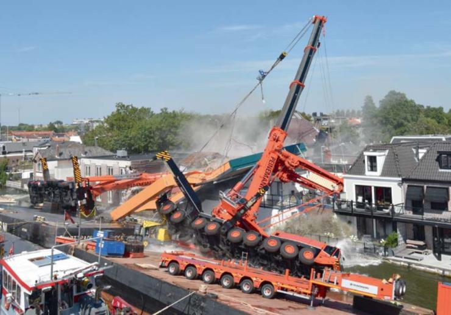
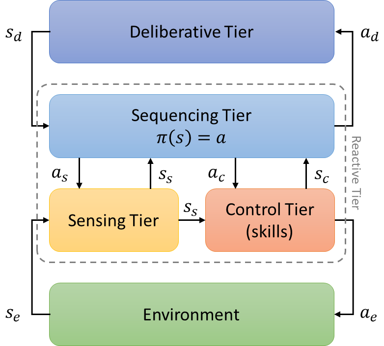

In the first post of the new year, I wanted to discuss some aspects of planning execution that, in my opinion, are too often overlooked by the planning community. In particular, I would like to focus on the execution of plans, and on the need to make plans adaptable and executable. Instead of focusing on the technical details, I would like to discuss some features that any planner, in my opinion, should possess in order to effectively interface with the real world. 

In their masterpiece, Ghallab et al. define planning as "the *reasoning* side of acting" \[[1](#r1)\]. Planning, in particular, represents an abstract, explicit deliberation process that chooses and organizes actions by anticipating their expected outcomes. Although [automated planning](https://en.wikipedia.org/wiki/Automated_planning_and_scheduling) constitutes a rich technical field, however, most of the literature on domain-independent planning is biased towards that "reasoning" side. Whether due to a partial knowledge of the world, or to the impossibility of predicting the actions of other agents that autonomously act in the same environment, a large part of any agent's behavior can be traced back to its ability to *react* to dynamic changes occurring, or predicted, in the world.

In this post, we will focus on the *execution* side of planning, and we will see how the [architecture](/research/#putting-things-together) used to integrate [deductive](/research/#deductive-reasoning) and [abductive](/research/#abductive-reasoning) forms of reasoning can be used, in automated planning, to integrate the above mentioned reasoning and reaction. We are talking, once again, about the following architecture, this time focusing on the $a_d$ actions, towards the deliberative tier, responsible, for example, for the creation and for the adaptation of the generated plans, and on the $s_d$ state, towards the reactive tier, responsible, for example, for the execution of the generated plans.

It is my opinion, in fact, that any planner and executor who can claim to be such, beyond the syntax, should provide functionalities similar to the $a_d$ actions and to the $s_d$ state. In the following section, we will enumerate these functionalities.

## Possible plan adaptations

The first steps towards the execution of a plan is to make it adaptable. In particular, a plan must be adapted to the current state of the world, which is not necessarily the same as the state of the world at the time the plan was generated. This adaptation is performed, in the arthitecture scheme shown before, by the $a_d$ actions, which are responsible for the creation and for the adaptation of the generated plans. In particular, the $a_d$ actions are responsible for the following tasks: (i) temporal *delays*, in case tasks are not ready to start/end; (ii) requirement *additions*, in case the reactive module requires the introduction of a new requirement (e.g., a new goal); and (iii) task *failures*, in case inconsistent constraints related to the task are introduced or unexpected events decrees its failure.

In other words, to realize these adaptation features, we need to implement the following primitives:

 - **delay(task_id id, time_interval d = 1)**: the execution of a task is delayed, because it is not ready to start;
 - **extend(task_id id, time_interval d = 1)**: the duration of a task is extended, because it is not ready to end;
 - **add(requirement req)**: a new requirement is added to the plan, because it is required by the reactive module;
 - **fail(set&lt;task_id&gt; tasks)**: the execution of a set of tasks has failed, because their constraints cannot be satisfied, or because unforeseen events in the real world have caused its failure.

The $s_d$ state towards the reactive tier, on the contrary, is more directly related to the execution of plans. The information coming from the deliberative tier, in particular, represent signals for the start and the termination of the planned tasks. Before running (or finishing) a planned task, however, you should check that you can run (or finish) the task considering the current state of the world. We would like to avoid, for example, having a social robot initiate a scheduled interaction task with a person who is not at home. In case it is not possible to start (terminate) a scheduled task, depending on the flexibility of the plan, we might want to try to delay it, before declaring it failed.

The primitives to implement, in this case, are:

 - **can_start(task_id id)**: check if it is possible to start the execution of a task, providing the possibility to invoke the **delay** primitive in case it is not possible;
 - **start(task_id id)**: the execution of a task is started, because it is ready to start;
 - **can_end(task_id id)**: check if it is possible to terminate the execution of a task, providing the possibility to invoke the **extend** primitive in case it is not possible;
 - **end(task_id id)**: the execution of a task is terminated, because it is ready to end.

Given the possibility, through the previous adaptation features, of generating a new plan from scratch, or to replace the current plan with another one, more in line with the dynamic evolution of reality, the [complexity](./2022/07/24/planning_complexity) of these adaptations reaches that of solving a planning problem from scratch. It is nonetheless possible to adopt strategies that are more efficient than the worst case, making the adaptations quite efficient. Such efficiency is particularly useful in interactive contexts such as those to which [social robots](https://en.wikipedia.org/wiki/Social_robot) are typically exposed. In these cases, in particular, the reactive response of a system becomes essential to make the interaction more engaging.

The [Plan Executor and Adaptor (PlExA)](https://github.com/ratioSolver/PlExA) takes care of managing these tasks. By implementing some [callback](https://en.wikipedia.org/wiki/Callback_(computer_programming)) functions, in particular, the user of the executor is notified, in due time, of the various tasks to be performed, thus realizing the $s_d$ primitives. The executor, furthermore, is able to manage any adaptations that, in the meantime, might have emerged from the real environment in which the plan is actually carried out. Adaptations, in particular, can concern the *delay* in starting or ending a task, the *failure* to execute a task as well as the dynamic *addition* of new requirements, thus realizing the $a_d$ primitives. The executor is hence able to manage these adaptations, and to update the plan accordingly. In this way, the plan is always in line with the current state of the world.

## Conclusion

In this short post, we have seen how the architecture used to integrate deductive and abductive forms of reasoning can be used, in automated planning, to integrate the reasoning and the reaction. In particular, we have seen how the $a_d$ actions, towards the deliberative tier, responsible for the creation and for the adaptation of the generated plans, and the $s_d$ state, towards the reactive tier, responsible for the execution of the generated plans, can be used to implement the primitives required to make plans adaptable and to execute them. With this post, in particular, I would like to try to rebalance between the reasoning and the reaction, and to show that, in order to be effective, a planner should be able to interface with the real world. In other words, if a plan is meant to be executed, any planner should be equipped with these capabilities, so as to avoid a detachment from reality. In a following post we will see how these primitives, required to make plans adaptable and to execute them, can be implemented.

### References

[1] Ghallab, M.; Nau, D. & Traverso, P. (2004), *Automated Planning: Theory and Practice*, Morgan Kaufmann, Amsterdam.